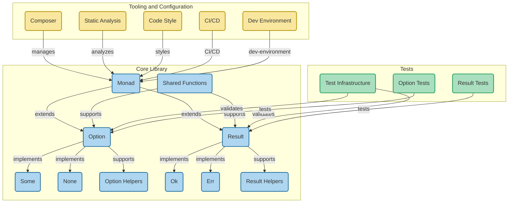

# php-monad

[](https://packagist.org/packages/wiz-develop/php-monad)
[](https://packagist.org/packages/wiz-develop/php-monad)
[](https://github.com/endou-mame/php-monad/actions)
[](LICENSE)
[](https://packagist.org/packages/wiz-develop/php-monad)

📦 PHP で関数型プログラミングのモナドの概念を実装したライブラリです。

## 目次

- [php-monad](#php-monad)
  - [目次](#目次)
  - [Features](#features)
  - [Installation](#installation)
  - [プロジェクト構造](#プロジェクト構造)
  - [Usage](#usage)
    - [Option Monad](#option-monad)
    - [Result Monad](#result-monad)
  - [API Reference](#api-reference)
    - [Option\<T\>](#optiont)
      - [静的メソッド](#静的メソッド)
      - [インスタンスメソッド](#インスタンスメソッド)
    - [Result\<T, E\>](#resultt-e)
      - [静的メソッド](#静的メソッド-1)
      - [インスタンスメソッド](#インスタンスメソッド-1)
  - [Contributing](#contributing)
  - [License](#license)
  - [References](#references)

## Features

- `Option<T>` - 「値がある」(`Some<T>`)か「値がない」(`None`)かを表現する型
- `Result<T, E>` - 「成功」(`Ok<T>`)か「失敗」(`Err<E>`)かを表現する型

## Installation

```bash
composer require wiz-develop/php-monad
```

## プロジェクト構造

以下の図は、php-monadプロジェクトの構造を表しています。コアライブラリ、テスト、ツールとその関連性を視覚的に示しています。



この図は以下の構成要素を示しています：

1. **コアライブラリ**：
   - 基本となるMonadクラス
   - Option型とそのSome/None実装
   - Result型とそのOk/Err実装
   - 共有関数やヘルパー関数

2. **テスト**：
   - テストインフラストラクチャ
   - Option型とResult型のテスト

3. **ツールと設定**：
   - Composer（依存関係管理）
   - 静的解析ツール
   - コードスタイルチェック
   - CI/CD設定
   - 開発環境設定

各ノードはGitHubリポジトリ内の該当ファイルにリンクされています。

## Usage

### Option Monad

`Option<T>` は値が存在する可能性がある場合に使用します。`null` の代わりに使用することで、より型安全なコードを書くことができます。

```php
use WizDevelop\PhpMonad\Option;

// 値がある場合（Some）
$some = Option::some("Hello, World!");
echo $some->unwrap(); // "Hello, World!"

// 値がない場合（None）
$none = Option::none();
// echo $none->unwrap(); // 例外が発生します

// 値の存在チェック
if ($some->isSome()) {
    echo "値が存在します";
}

// デフォルト値の提供
echo $none->unwrapOr("Default Value"); // "Default Value"

// mapによる値の変換
$length = $some->map(fn($str) => strlen($str)); // Option::some(13)

// フィルタリング
$filtered = $some->filter(fn($str) => strlen($str) > 10); // Option::some("Hello, World!")
$filtered = $some->filter(fn($str) => strlen($str) > 20); // Option::none()

// 複数のOptionを連鎖
function findUser(string $id): Option {
    // ...
}

function getUserPreferences(User $user): Option {
    // ...
}

$preferences = findUser("123")
    ->flatMap(fn($user) => getUserPreferences($user));
```

### Result Monad

`Result<T, E>` は処理が成功するか失敗するかを表現するのに使用します。例外を投げる代わりに使用することで、エラーハンドリングを型安全に行うことができます。

```php
use WizDevelop\PhpMonad\Result;

// 成功の場合（Ok）
$ok = Result::ok(42);
echo $ok->unwrap(); // 42

// 失敗の場合（Err）
$err = Result::err("Something went wrong");
// echo $err->unwrap(); // 例外が発生します
echo $err->unwrapErr(); // "Something went wrong"

// エラーチェック
if ($ok->isOk()) {
    echo "処理は成功しました";
}

if ($err->isErr()) {
    echo "エラーが発生しました";
}

// デフォルト値の提供
echo $err->unwrapOr(0); // 0

// mapによる値の変換
$doubled = $ok->map(fn($n) => $n * 2); // Result::ok(84)

// エラー値の変換
$newErr = $err->mapErr(fn($e) => "Error: " . $e); // Result::err("Error: Something went wrong")

// 複数のResultを連鎖
function fetchData(string $url): Result {
    // ...
}

function processData($data): Result {
    // ...
}

$processed = fetchData("https://api.example.com")
    ->flatMap(fn($data) => processData($data));
```

## API Reference

### Option\<T\>

#### 静的メソッド
- `Option::some($value)` - Some\<T\>インスタンスを生成
- `Option::none()` - Noneインスタンスを生成
- `Option::from($value)` - 値からOptionを生成（nullの場合はNone、それ以外はSome）

#### インスタンスメソッド
- `isSome(): bool` - 値が存在するかチェック
- `isNone(): bool` - 値が存在しないかチェック
- `unwrap(): T` - 値を取り出す（Noneの場合は例外）
- `unwrapOr($default): T` - 値を取り出すか、デフォルト値を返す
- `map(callable $f): Option<U>` - 値を変換
- `flatMap(callable $f): Option<U>` - 値を別のOptionに変換
- `filter(callable $predicate): Option<T>` - 条件に合致する場合のみSomeを返す
- `expect(string $msg): T` - 値を取り出す（Noneの場合はカスタムメッセージで例外）
- `toResult($err): Result<T, E>` - OptionをResultに変換

### Result\<T, E\>

#### 静的メソッド
- `Result::ok($value)` - Ok\<T\>インスタンスを生成
- `Result::err($error)` - Err\<E\>インスタンスを生成

#### インスタンスメソッド
- `isOk(): bool` - 処理が成功したかチェック
- `isErr(): bool` - 処理が失敗したかチェック
- `unwrap(): T` - 値を取り出す（Errの場合は例外）
- `unwrapOr($default): T` - 値を取り出すか、デフォルト値を返す
- `unwrapErr(): E` - エラー値を取り出す（Okの場合は例外）
- `map(callable $f): Result<U, E>` - 値を変換
- `mapErr(callable $f): Result<T, F>` - エラー値を変換
- `flatMap(callable $f): Result<U, E>` - 値を別のResultに変換
- `expect(string $msg): T` - 値を取り出す（Errの場合はカスタムメッセージで例外）
- `toOption(): Option<T>` - ResultをOptionに変換

## Contributing

貢献は歓迎します！バグ報告、機能リクエスト、プルリクエストなど、どんな形でも構いません。

1. リポジトリをフォークする
2. 機能ブランチを作成する (`git checkout -b feature/amazing-feature`)
3. 変更をコミットする (`git commit -m 'Add some amazing feature'`)
4. ブランチをプッシュする (`git push origin feature/amazing-feature`)
5. プルリクエストを作成する

## License

MIT License - [LICENSE](LICENSE)ファイルをご覧ください。

## References
- [Option型とResult型で安全なPHPを書こう](https://zenn.dev/pixiv/articles/f109b02aa9d4e0)
- [Rust - Option enum](https://doc.rust-lang.org/std/option/enum.Option.html)
- [Rust - Result enum](https://doc.rust-lang.org/std/result/enum.Result.html)
- [Functional programming in PHP](https://phel-lang.org/)
