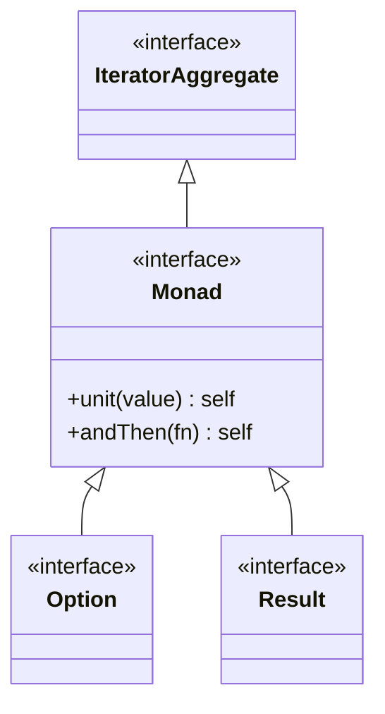

# Monad インターフェース

`Monad` は Option と Result の基底インターフェースです。Haskell のモナド概念を PHP で表現しています。

## 定義

```php
namespace WizDevelop\PhpMonad;

/**
 * @template T
 * @extends IteratorAggregate<T>
 */
#[Sealed(permits: [Result::class, Option::class])]
interface Monad extends IteratorAggregate
```

## 特徴

- `#[Sealed]` 属性により、Option と Result のみが実装可能
- `IteratorAggregate` を継承し、foreach で使用可能
- 不変（immutable）オブジェクト

## メソッド

### unit

値をモナドでラップします。Haskell の `return` に相当します。

```php
public static function unit(mixed $value): self;
```

#### シグネチャ

```
@template TValue
@param TValue $value
@return Monad<TValue>
```

#### 使用例

```php
use WizDevelop\PhpMonad\Option\Some;
use WizDevelop\PhpMonad\Result\Ok;

$some = Some::unit(42);  // Some<int>
$ok = Ok::unit(42);      // Ok<int>
```

::: tip ヘルパー関数を推奨
通常は `unit` を直接呼び出すのではなく、ヘルパー関数を使用します。

```php
use function WizDevelop\PhpMonad\Option\some;
use function WizDevelop\PhpMonad\Result\ok;

$some = some(42);
$ok = ok(42);
```
:::

### andThen

値を受け取りモナドを返す関数を適用します。Haskell の `>>=`（bind）に相当します。

```php
public function andThen(Closure $right): self;
```

#### シグネチャ

```
@template U
@param Closure(T): Monad<U> $right
@return Monad<U>
```

#### 使用例

```php
use function WizDevelop\PhpMonad\Option\{some, none};

function double(int $x): Option {
    return some($x * 2);
}

$result = some(5)->andThen(double(...));  // Some(10)
$result = none()->andThen(double(...));   // None
```

```php
use function WizDevelop\PhpMonad\Result\{ok, err};

function divide(int $x): Result {
    return $x === 0 ? err('ゼロ除算') : ok(100 / $x);
}

$result = ok(10)->andThen(divide(...));  // Ok(10)
$result = ok(0)->andThen(divide(...));   // Err('ゼロ除算')
$result = err('e')->andThen(divide(...));  // Err('e')
```

## イテレーション

Monad は `IteratorAggregate` を実装しているため、foreach で使用できます。

```php
$option = some(42);

foreach ($option as $value) {
    echo $value;  // 42
}

$none = none();

foreach ($none as $value) {
    // 実行されない
}
```

## 型階層


